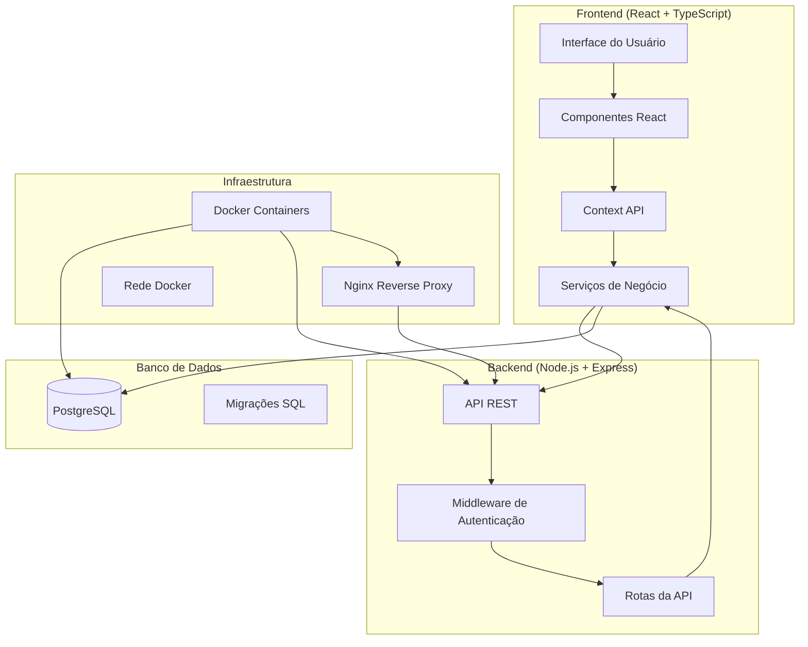
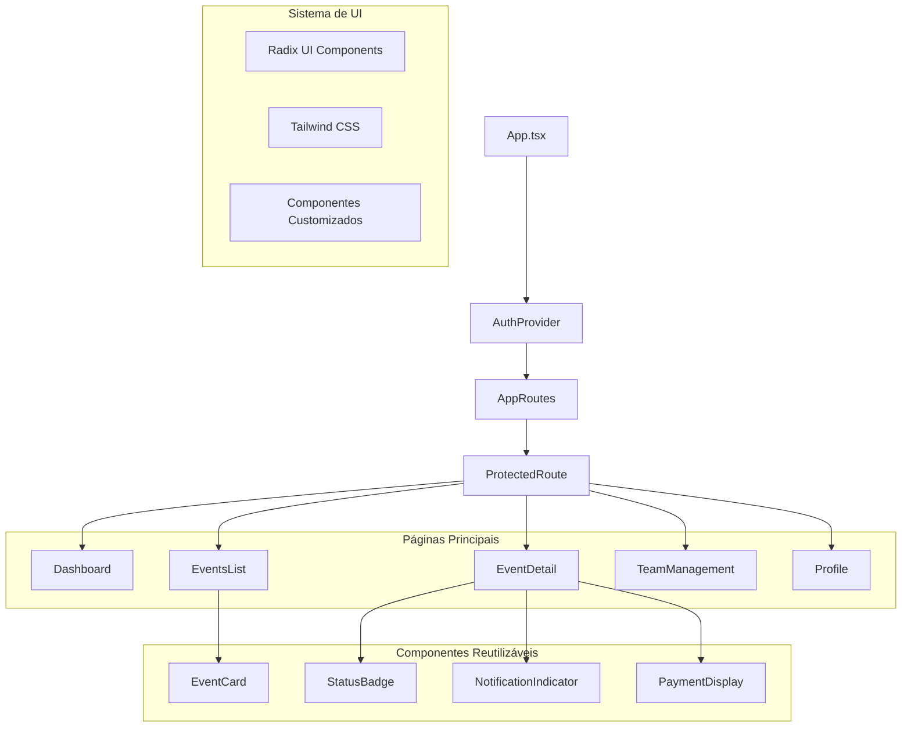
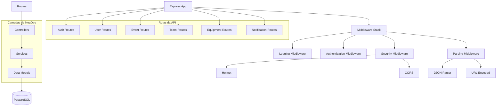
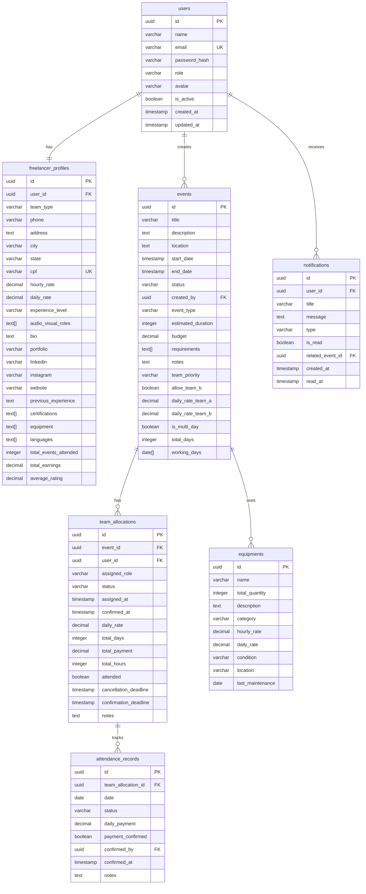
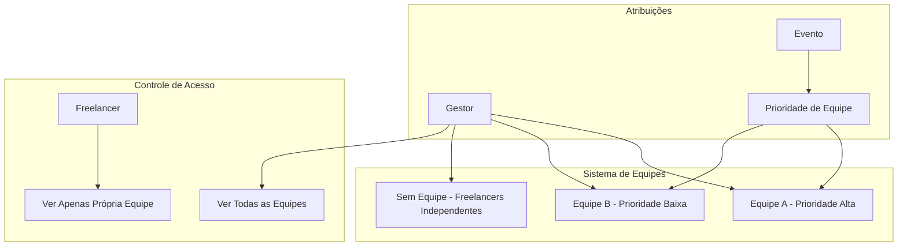
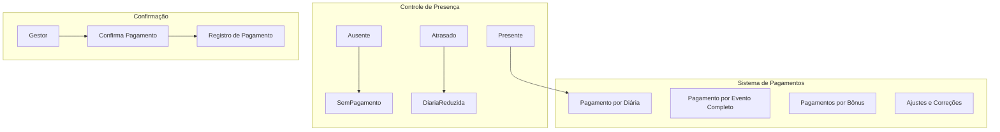
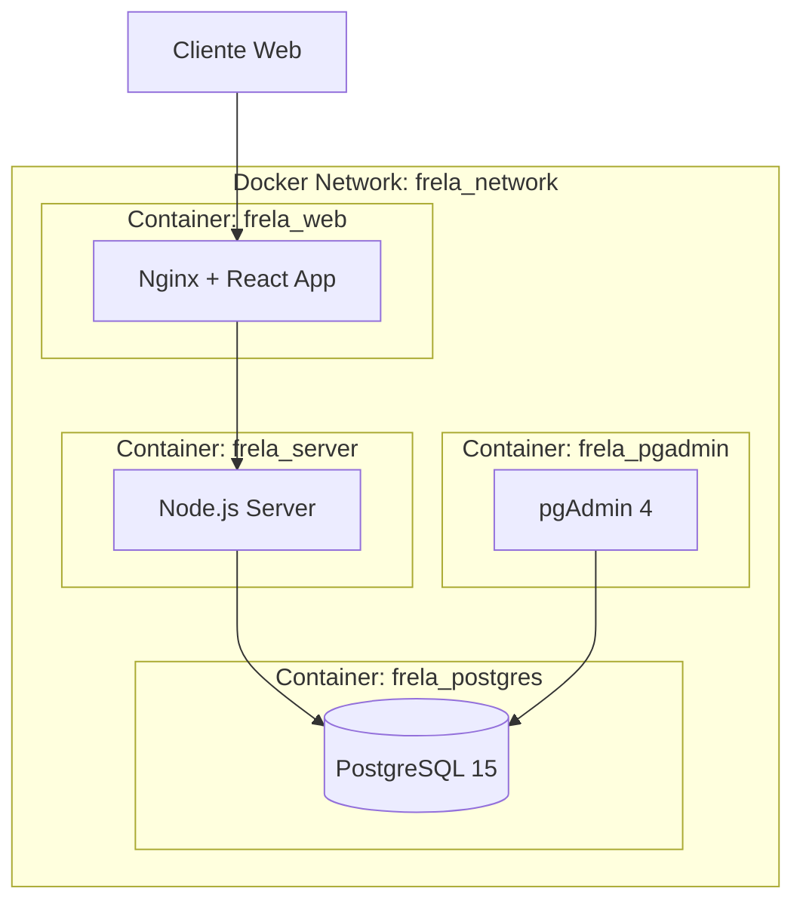

# Arquitetura da Aplicação FRELA_M

## Visão Geral

O **FRELA_M** (Event Team Sync) é uma aplicação web completa para gerenciamento de equipes de eventos audiovisuais, desenvolvida com arquitetura moderna full-stack utilizando React, Node.js, PostgreSQL e Docker.

## Arquitetura Geral



## Stack Tecnológica

### Frontend
- **React 18.3.1** - Biblioteca principal para interface
- **TypeScript 5.5.3** - Tipagem estática
- **Vite 5.4.1** - Build tool e dev server
- **Tailwind CSS 3.4.11** - Framework CSS utilitário
- **Radix UI** - Componentes acessíveis e customizáveis
- **React Router DOM 6.26.2** - Roteamento
- **React Query (TanStack)** - Gerenciamento de estado e cache
- **React Hook Form 7.53.0** - Formulários
- **Zod 3.23.8** - Validação de schemas

### Backend
- **Node.js** - Runtime JavaScript
- **Express 4.18.2** - Framework web
- **TypeScript** - Tipagem estática
- **PostgreSQL 15** - Banco de dados relacional
- **JWT** - Autenticação baseada em tokens
- **bcryptjs** - Hash de senhas
- **Nodemailer** - Envio de emails
- **CORS** - Cross-Origin Resource Sharing
- **Helmet** - Segurança HTTP

### Infraestrutura
- **Docker** - Containerização
- **Docker Compose** - Orquestração de serviços
- **Nginx** - Reverse proxy e servidor web
- **PostgreSQL** - Banco de dados principal
- **pgAdmin** - Interface de administração do banco

## Estrutura do Projeto

```
event-team-sync/
├── src/                          # Código fonte do frontend
│   ├── components/               # Componentes React reutilizáveis
│   │   ├── ui/                  # Componentes base (Radix UI)
│   │   └── ...                  # Componentes específicos
│   ├── pages/                   # Páginas da aplicação
│   │   ├── Events/             # Páginas relacionadas a eventos
│   │   ├── TeamManagement/     # Páginas de gestão de equipes
│   │   └── ...                 # Outras páginas
│   ├── contexts/                # Context API (Auth, etc.)
│   ├── hooks/                   # Hooks customizados
│   ├── services/                # Serviços de API
│   ├── types/                   # Definições de tipos TypeScript
│   ├── utils/                   # Utilitários
│   └── config/                  # Configurações
├── server/                      # Código fonte do backend
│   ├── routes/                  # Rotas da API
│   ├── middleware/              # Middleware (auth, error handling)
│   ├── config/                  # Configurações do servidor
│   └── scripts/                 # Scripts utilitários
├── database/                    # Scripts e migrações do banco
├── public/                      # Arquivos estáticos
├── dist/                        # Build de produção
└── docker/                      # Configurações Docker
```

## Arquitetura do Frontend

### Estrutura de Componentes



### Gerenciamento de Estado

- **Context API** para autenticação global
- **React Query** para cache e sincronização de dados
- **Local Storage** para persistência de sessão
- **Estado local** para formulários e componentes específicos

### Sistema de Roteamento

```typescript
// Rotas protegidas com autenticação
<Route path="/dashboard" element={<ProtectedRoute><Dashboard /></ProtectedRoute>} />
<Route path="/events" element={<ProtectedRoute><EventsList /></ProtectedRoute>} />
<Route path="/team-management" element={<ProtectedRoute><TeamManagement /></ProtectedRoute>} />

// Rotas públicas
<Route path="/login" element={<Login />} />
```

## Arquitetura do Backend

### Estrutura do Servidor



### Middleware Stack

1. **Helmet** - Headers de segurança HTTP
2. **CORS** - Configuração de cross-origin
3. **JSON Parser** - Parsing de requisições JSON
4. **URL Encoded** - Parsing de formulários
5. **Logging** - Log de requisições
6. **Authentication** - Verificação de JWT
7. **Error Handler** - Tratamento global de erros

### Sistema de Autenticação

- **JWT (JSON Web Tokens)** para autenticação
- **bcryptjs** para hash de senhas
- **Middleware de autenticação** para rotas protegidas
- **Refresh tokens** para renovação de sessão

## Arquitetura do Banco de Dados

### Modelo de Dados



### Índices e Performance

- **Índices primários** em todas as chaves primárias
- **Índices secundários** em campos frequentemente consultados
- **Índices compostos** para consultas complexas
- **Triggers** para atualização automática de timestamps

### Relacionamentos

- **One-to-One**: `users` ↔ `freelancer_profiles`
- **One-to-Many**: `users` → `events`, `events` → `team_allocations`
- **Many-to-Many**: `events` ↔ `equipments` (via `equipment_allocations`)

## Sistema de Equipes

### Estrutura de Equipes



### Priorização de Equipes

- **Equipe A**: Prioridade alta para eventos especiais
- **Equipe B**: Prioridade baixa, usado quando A não está disponível
- **Sem Equipe**: Freelancers independentes para projetos específicos

## Sistema de Eventos

### Tipos de Eventos

```typescript
type EventType = 'normal' | 'especial';

interface Event {
  eventType: EventType;
  teamPriority: 'equipe_a' | 'equipe_b' | 'ambas';
  allowTeamB: boolean;
  dailyRateTeamA: number;
  dailyRateTeamB: number;
  isMultiDay: boolean;
  totalDays: number;
  workingDays: string[];
}
```

### Programação de Eventos

- **Eventos de um dia**: Pagamento por diária
- **Eventos multi-dia**: Programação detalhada por dia
- **Dias de setup/teardown**: Configuração e desmontagem
- **Controle de presença**: Lista de chamada diária

## Sistema de Pagamentos

### Estrutura de Pagamentos



### Tipos de Pagamento

- **Pagamento por diária**: Baseado na presença diária
- **Pagamento por evento completo**: Valor total do evento
- **Bônus**: Pagamentos extras por performance
- **Ajustes**: Correções e compensações

## Sistema de Notificações

### Tipos de Notificações

```typescript
type NotificationType = 
  | 'allocation'      // Nova alocação
  | 'update'          // Atualização de evento
  | 'reminder'        // Lembretes
  | 'checkin'         // Check-in/Check-out
  | 'payment'         // Confirmação de pagamento
  | 'schedule_conflict'; // Conflito de agenda
```

### Sistema de Prioridades

- **Baixa**: Informações gerais
- **Média**: Atualizações importantes
- **Alta**: Ações requeridas
- **Urgente**: Requer atenção imediata

## Infraestrutura Docker

### Arquitetura de Containers



### Configuração de Serviços

#### PostgreSQL
- **Porta**: 5432
- **Database**: frela_db
- **Usuário**: frela_user
- **Health Check**: pg_isready

#### pgAdmin
- **Porta**: 5050
- **Email**: admin@frela.com
- **Dependência**: PostgreSQL (health check)

#### Servidor Node.js
- **Porta**: 3001
- **Dependência**: PostgreSQL (health check)
- **Volumes**: server/ e database/
- **Restart**: unless-stopped

#### Frontend + Nginx
- **Porta**: 80
- **Dependência**: Servidor Node.js
- **Reverse Proxy**: Para API do servidor

## Segurança

### Camadas de Segurança

1. **Helmet.js**: Headers de segurança HTTP
2. **CORS**: Controle de cross-origin
3. **JWT**: Autenticação baseada em tokens
4. **bcryptjs**: Hash seguro de senhas
5. **Validação**: Schemas Zod para validação de dados
6. **Rate Limiting**: Proteção contra ataques de força bruta

### Autenticação e Autorização

```typescript
// Middleware de autenticação
const authenticateToken = (req, res, next) => {
  const token = req.headers.authorization?.split(' ')[1];
  if (!token) return res.sendStatus(401);
  
  jwt.verify(token, process.env.JWT_SECRET, (err, user) => {
    if (err) return res.sendStatus(403);
    req.user = user;
    next();
  });
};
```

## Performance e Escalabilidade

### Otimizações de Frontend

- **Code Splitting**: Carregamento lazy de componentes
- **React Query**: Cache inteligente de dados
- **Bundle Optimization**: Vite para build otimizado
- **Image Optimization**: Otimização de assets

### Otimizações de Backend

- **Connection Pooling**: Pool de conexões PostgreSQL
- **Query Optimization**: Índices estratégicos
- **Caching**: Cache de consultas frequentes
- **Async/Await**: Operações não-bloqueantes

### Otimizações de Banco

- **Índices**: Para consultas frequentes
- **Triggers**: Atualizações automáticas
- **Constraints**: Integridade referencial
- **Partitioning**: Para tabelas grandes (futuro)

## Monitoramento e Logs

### Sistema de Logs

```typescript
// Logging middleware
app.use((req, res, next) => {
  console.log(`${new Date().toISOString()} - ${req.method} ${req.path}`);
  next();
});
```

### Health Checks

- **API Health**: `/api/health`
- **Database Health**: pg_isready
- **Container Health**: Docker health checks

## Deploy e CI/CD

### Scripts de Deploy

- **docker-manager.ps1**: Scripts PowerShell para Windows
- **docker-manager.sh**: Scripts Bash para Linux/macOS
- **Docker Compose**: Orquestração de serviços

### Variáveis de Ambiente

```bash
# Configuração do banco
DB_USER=frela_user
DB_HOST=localhost
DB_NAME=frela_db
DB_PASSWORD=frela_password
DB_PORT=5432

# Configuração do servidor
PORT=3001
JWT_SECRET=your-secret-key
NODE_ENV=development
```

## Funcionalidades Principais

### Para Gestores

1. **Gestão de Eventos**: Criação, edição, cancelamento
2. **Gestão de Equipes**: Alocação de freelancers
3. **Controle de Presença**: Lista de chamada
4. **Gestão de Pagamentos**: Confirmação e registro
5. **Relatórios**: Estatísticas e análises

### Para Freelancers

1. **Visualização de Eventos**: Apenas eventos da própria equipe
2. **Confirmação de Presença**: Aceitar/rejeitar alocações
3. **Check-in/Check-out**: Registro de presença
4. **Perfil Profissional**: Atualização de informações
5. **Histórico**: Eventos anteriores e pagamentos

## Roadmap e Melhorias Futuras

### Funcionalidades Planejadas

1. **Sistema de Avaliações**: Rating de freelancers
2. **Integração com Pagamentos**: PIX, cartão, etc.
3. **App Mobile**: Versão mobile nativa
4. **Sistema de Chat**: Comunicação em tempo real
5. **Analytics Avançados**: Dashboards de performance
6. **API Pública**: Integração com terceiros

### Melhorias Técnicas

1. **Microserviços**: Separação de domínios
2. **Message Queue**: Processamento assíncrono
3. **Cache Redis**: Cache distribuído
4. **Load Balancer**: Balanceamento de carga
5. **Monitoramento**: APM e métricas
6. **Testes**: Testes automatizados

## Conclusão

O FRELA_M é uma aplicação robusta e bem arquitetada que demonstra boas práticas de desenvolvimento moderno. A arquitetura em camadas, uso de TypeScript, containerização Docker e design responsivo tornam a aplicação escalável, manutenível e preparada para crescimento futuro.

A separação clara entre frontend e backend, o sistema de autenticação seguro, e a estrutura de banco de dados bem normalizada fornecem uma base sólida para funcionalidades avançadas e integrações futuras.
