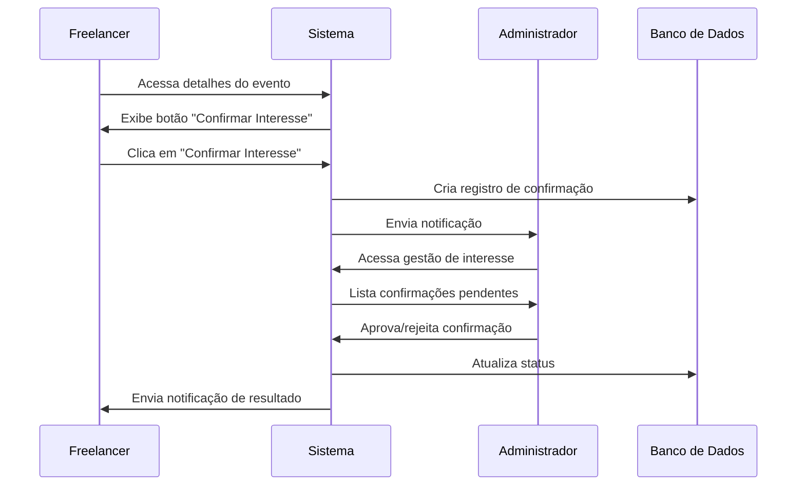

# Funcionalidade de Confirmação de Interesse em Eventos

> **Descontinuado (2026):** o produto passou a usar **escalação pelo gestor** com **confirmação de disponibilidade** via API Express (`/api/teams/allocate`, confirmação/recusa na alocação). O documento abaixo descreve o fluxo antigo apenas para referência histórica.

## Visão Geral

Esta funcionalidade permitia que freelancers confirmassem interesse em eventos específicos (fluxo substituído pelo descrito acima).

## Como Funciona

### Para Freelancers

1. **Acessar Detalhes do Evento**: O freelancer navega para a página de detalhes de um evento onde está alocado
2. **Confirmar Interesse**: Clica no botão "Confirmar Interesse" na seção específica para freelancers
3. **Status da Confirmação**: Pode visualizar o status da sua confirmação (pendente, aprovada ou rejeitada)
4. **Cancelar Interesse**: Pode cancelar sua confirmação de interesse a qualquer momento

### Para Administradores

1. **Receber Notificações**: Quando um freelancer confirma interesse, o administrador recebe uma notificação
2. **Gerenciar Confirmações**: Acessa a página "Interesse em Eventos" no menu lateral
3. **Aprovar/Rejeitar**: Pode aprovar ou rejeitar as confirmações pendentes
4. **Adicionar Observações**: Pode incluir observações sobre a aprovação ou rejeição

## Arquivos Implementados

### Frontend

- **`src/services/eventInterestService.ts`**: Serviço para gerenciar confirmações de interesse
- **`src/pages/Events/EventDetail.tsx`**: Página de detalhes do evento com botão de confirmação
- **`src/pages/TeamManagement/EventInterestManagement.tsx`**: Página de gestão para administradores
- **`src/App.tsx`**: Nova rota `/event-interest-management`
- **`src/components/AppLayout.tsx`**: Link no menu lateral para administradores

### Backend

- **`server/routes/events.ts`**: Novas rotas para confirmação de interesse
- **`server/routes/eventInterest.ts`**: Rotas para gestão de confirmações
- **`server/index.ts`**: Registro das novas rotas

### Banco de Dados

- **`database/create_event_interest_table.sql`**: Script para criar a tabela
- **`database/run_event_interest_migration.sql`**: Script completo de migração

## Estrutura do Banco de Dados

### Tabela: `event_interest_confirmations`

| Campo | Tipo | Descrição |
|-------|------|-----------|
| `id` | UUID | Identificador único |
| `event_id` | UUID | ID do evento (referência) |
| `user_id` | UUID | ID do freelancer (referência) |
| `status` | VARCHAR(20) | Status: 'pending', 'confirmed', 'rejected' |
| `confirmed_at` | TIMESTAMP | Data/hora da aprovação |
| `rejected_at` | TIMESTAMP | Data/hora da rejeição |
| `notes` | TEXT | Observações do administrador |
| `created_at` | TIMESTAMP | Data/hora de criação |
| `updated_at` | TIMESTAMP | Data/hora da última atualização |

## Fluxo de Funcionamento



## Instalação

### 1. Executar Migração do Banco

```bash
# Conectar ao banco PostgreSQL e executar:
psql -U seu_usuario -d seu_banco -f database/run_event_interest_migration.sql
```

### 2. Reiniciar o Servidor

```bash
# Parar o servidor atual
npm run dev:server

# Iniciar novamente
npm run dev:server
```

### 3. Verificar Funcionamento

1. Acesse como freelancer e confirme interesse em um evento
2. Acesse como administrador e verifique a notificação
3. Acesse a página "Interesse em Eventos" para gerenciar

## Endpoints da API

### Confirmação de Interesse

- **POST** `/api/events/:id/confirm-interest` - Confirmar interesse
- **GET** `/api/events/:id/interest-status` - Verificar status
- **DELETE** `/api/events/:id/cancel-interest` - Cancelar interesse

### Gestão (Administradores)

- **GET** `/api/event-interest` - Listar todas as confirmações
- **GET** `/api/event-interest/event/:eventId` - Confirmações por evento
- **PATCH** `/api/event-interest/:id/approve` - Aprovar confirmação
- **PATCH** `/api/event-interest/:id/reject` - Rejeitar confirmação
- **GET** `/api/event-interest/stats/overview` - Estatísticas

## Notificações

### Para Administradores
- **Título**: "Novo Interesse Confirmado"
- **Mensagem**: "O freelancer [Nome] confirmou interesse no evento [Título]"
- **Tipo**: `allocation`
- **Prioridade**: `medium`
- **Ação Requerida**: `true`

### Para Freelancers
- **Aprovado**: "Seu interesse no evento foi aprovado pelo administrador."
- **Rejeitado**: "Seu interesse no evento foi rejeitado pelo administrador. Motivo: [observações]"

## Validações

- Apenas freelancers podem confirmar interesse
- Usuário deve estar alocado no evento
- Uma confirmação por usuário por evento
- Apenas administradores podem aprovar/rejeitar
- Notificações automáticas em todas as ações

## Tratamento de Erros

- Validação de permissões de usuário
- Verificação de existência de evento e usuário
- Tratamento de conflitos de confirmação
- Rollback em caso de falhas na criação de notificações

## Próximos Passos Sugeridos

1. **Dashboard de Estatísticas**: Adicionar gráficos e métricas
2. **Filtros Avançados**: Por data, equipe, status, etc.
3. **Exportação de Dados**: Relatórios em PDF/Excel
4. **Histórico de Alterações**: Log de todas as mudanças de status
5. **Integração com Calendário**: Visualização em calendário
6. **Notificações por Email**: Além das notificações in-app

## Suporte

Para dúvidas ou problemas com esta funcionalidade, consulte:
- Logs do servidor para erros de backend
- Console do navegador para erros de frontend
- Banco de dados para verificar integridade dos dados
